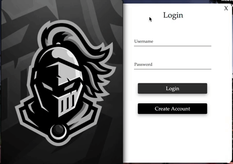
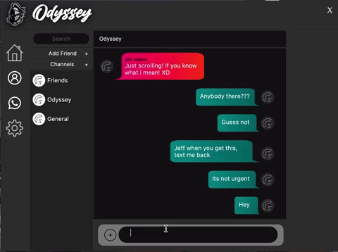
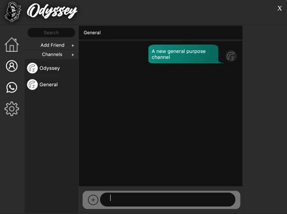
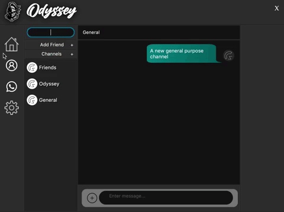

# Namespace

Simple Chat application that uses realtime communication API, PubNub, to provide communication among users.

## Getting Started
Run the following command to make a copy of this repository on your computer:
```bash
git clone https://github.com/JTA-Odyssey/Namespace.git
```
# Application Preview
### Login


### Messaging


### Channel Feature


### Profile Feature


